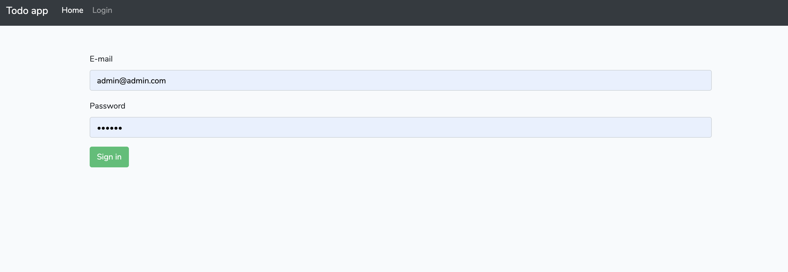
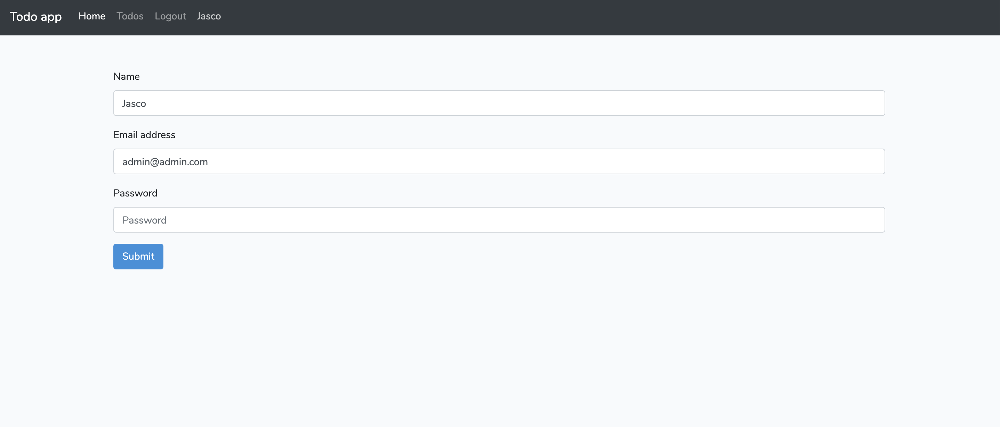
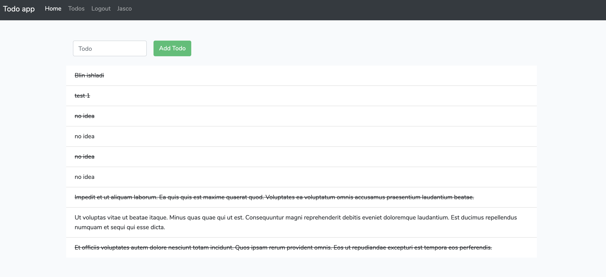

# Todo app with laravel and vue
This is demo app in laravel, vue js and JWT auth

## Usage
1. Clone the project
``bash
git clone https://github.com/jasco-b/laravel-vue-todo.git
``
2. Change your dir
3. install composer dependencies
``bash
composer install
``
4. Copy .env.example file as .env
``bash
cp .env.example .env
``
5. Configure db
6. Migrate and seed
``bash
 php artisan migrate --seed
``
7. Install npm dependencies ``npm install``
8. Compile js and css assets ``npm run dev``
9. Run server ``php artisan server``
10. On your web browser use http://localhost:8000 :)

## Test
The project has test. Run test:
```bash
php artisan test
```

## API

| Name                            | Url                                          | Method | Params                |
|---------------------------------|----------------------------------------------|--------|-----------------------|
| Login                           | {url}/api/auth/login                         | POST   | email, password       |
| Logout                          | {url}/api/auth/logout                        | POST   |                       |
| Profile Info                    | {url}/api/profile                            | GET    |                       |
| Profile update                  | {url}/api/profile                            | PUT    | name, email, password |
| User todos                      | {url}/api/users/{user}/todos                 | GET    |                       |
| Create todo                     | {url}/api/users/{user}/todos                 | POST   | task                  |
| Update todo                     | {url}/api/users/{user}/todos/{todo}          | UPDATE | task, status          |
| Delete todo                     | {url}/api/users/{user}/todos/{todo}          | DELETE |                       |
| Change Todo status to completed | {url}/api/users/{user}/todos/{todo}/complete | PUT    |                       |


### Some images:
Login:


Profile:


Todos:

